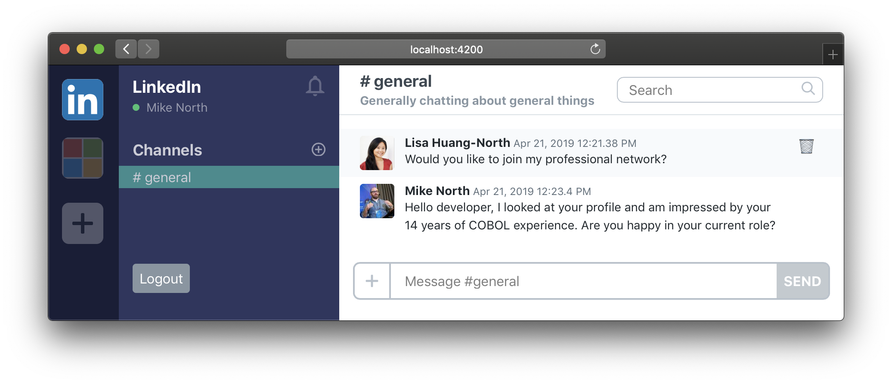

# Template-Only Components

Components are modular chunksof UI, and can have a `.js` file, a `.hbs` file or both. We'll start with the simplest kind of component -- ones that involve no state of their own, and are defined only by a `.hbs` template file.

Usually we'd use Ember CLI to generate new components, but in this case we'll just create a new `.hbs` file for each.

## ⌨️ Task: Break `application.hbs` up into several template-only components

The goal of this step is to break various parts of [`app/templates/application.hbs`](../app/templates/application.hbs) into their own respective `.hbs` files as template-only components. In the end, your `application.hbs` should look like

```hbs
<TeamSelector />
<TeamSidebar />
<main class="flex-1 flex flex-col bg-white overflow-hidden channel">
  <ChannelHeader />

  <div class="py-4 flex-1 overflow-y-scroll channel-messages-list" role="list">
    <ChatMessage />
    <ChatMessage />
  </div>

  <ChannelFooter />
</main>
```

1.  Create [`app/templates/components/team-selector.hbs`](../app/templates/components/team-selector.hbs)
    - Move `<nav class="team-selector">...</nav>` into it
    - Replace what you deleted from [`application.hbs`](../app/templates/application.hbs) with `<TeamSelector />`
1.  Create [`app/templates/components/team-sidebar.hbs`](../app/templates/components/team-sidebar.hbs)
    - Move `<section class="team-sidebar">...</section>` into it
    - Replace what you deleted from [`application.hbs`](../app/templates/application.hbs) with `<TeamSidebar />`
1.  Create [`app/templates/components/channel-header.hbs`](../app/templates/components/channel-header.hbs)
    - Move `<header class="channel-header">...</header>` into it
    - Replace what you deleted from [`application.hbs`](../app/templates/application.hbs) with `<ChannelHeader />`
1.  Create [`app/templates/components/channel-footer.hbs`](../app/templates/components/channel-footer.hbs)
    - Move `<footer class="channel-footer">...</footer>` into it
    - Replace what you deleted from [`application.hbs`](../app/templates/application.hbs) with `<ChannelFooter />`
1.  Create [`app/templates/components/chat-message.hbs`](../app/templates/components/chat-message.hbs)
    - Move one of the `<div class="message">...</div>` into it
      - NOTE: the starting point HTML has more than one of these. Pick one to use for the component, and for now we'll just repeat it several times
    - Replace what you deleted from [`application.hbs`](../app/templates/application.hbs) with 2 `<ChannelMessage />`s

At the end of this, you should see no change to the rendered HTML at <http://localhost:4200>.



Congrats! You've just broken down all of that HTML into components!
