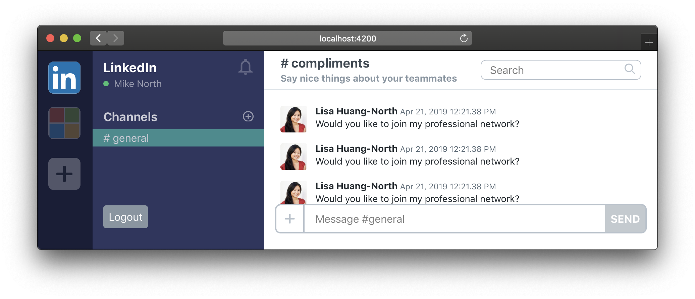

# Parameterized Components

We can parameterize components by substituting some of the text in our hardcoded HTML with handlebars expressions (things that look like `{{ something }}`). Think of this kind of like how we can pass arguments to a function in order to get them to return new values.

```jsx
// ⚠️️ Pesudocode ⚠️
function renderChannelHeader(args) {
    return
        <header>
            <h3>{{args.title}}</h3>
            <p> {{args.description}}</p>
        </header>
    ;
}
```

Ember calls values that are passed into a component from the outside world in this fashion [`named args`](https://github.com/emberjs/rfcs/blob/master/text/0276-named-args.md). We can recognize these named args in a template because they always begin with an `@` sign.

## ⌨️ Task: Parameterizing `<ChannelHeader />`

The goal of this task is to modify `<ChannelHeader />` such that we can pass in a title and description of our choice.

in [`app/templates/components/channel-header.hbs`](../app/templates/components/channel-header.hbs)

1.  find the text `general` and replace it with `{{@title}}`
2.  Find the text `Generally chatting about general things` and replace it with `{{@description}}`

Our component is now parameterized, and ready to receive data!

### Syntax breakdown

- The `{{double-braces}}` indicate that the whatever is between them should be evaluted as a handlebars expression
- The `@` indicates that `title` and `description` are named args, passed into the component from the outside world

### Passing in data

You may notice that your component now shows a blank title and description. Instead of rendering hard-coded values, the component now expects to be passed `args` called `@title` and `@description`. Let's pass it some data:

Go to your [`app/templates/application.hbs`](../app/templates/application.hbs) and pass some values into the component using key-value pairs

```hbs
<ChannelHeader
    @title="compliments"
    @description="Say nice things about your teammates" />
```

Now, you should see the title and description properly rendered in the channel header


