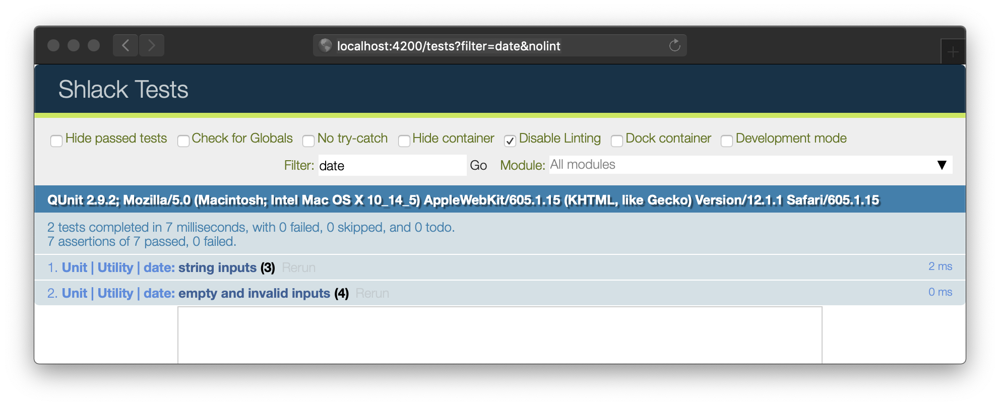

# Helpers

Helpers are like simple functions that can be used in templates. We'll create a simple one to allow us to create a string representation of a `Date` (or a `string`/`number` passed to the `Date` constructor). A library like [Moment.js](http://momentjs.com/) would be able to perform a similar task, but given that it's fairly large (16.7k minified, gzipped) it's probably overkill for just this one thing.

Once defined, helpers can be used in _any_ of an app's templates.

## ⌨️ Task: Implementing a `dateToString` utility

The goal of this task is to define a JavaScript module for date-related utilities, a `dateToString` function within it that transforms date-like values into strings, and accompanying unit tests.

Your `app/utils` folder is a great place for low-level utilities like these. Let's generate a `utils` module by running

```sh
ember generate util date
```

Ember CLI will generate the following files:

- [`app/utils/date.js`](../app/utils/date.js) - the utils module
- [`tests/unit/utils/date-test.js`](../tests/unit/utils/date-test.js) - a passing unit test

Replace the contents of [`app/utils/date.js`](../app/utils/date.js) with the following:

<details>
  
  <summary>Click to reveal <code>date.js</code></summary>

```js {starter-file=date.js}
const MONTH_NAMES = [
  'Jan',
  'Feb',
  'Mar',
  'Apr',
  'May',
  'Jun',
  'Jul',
  'Aug',
  'Sep',
  'Oct',
  'Nov',
  'Dec',
];

/**
 * Pad a numeric value with zeroes, if needed
 *
 * @example
 *
 * padLeadingZeroes(13, 4); // "0013"
 * padLeadingZeroes(130, 2); // "130"
 *
 * @param {number} val value
 * @param {number} digits number of digits to pad
 * @returns {string}
 */
function padLeadingZeroes(val, digits) {
  let valString = `${val}`;
  while (valString.length < digits) valString = 0 + valString;
  return valString;
}

/**
 * Create a string representation of a Date
 * @param {string|number|Date} date
 * @returns {string}
 */
export function dateToString(date) {
  if (
    !(
      typeof date === 'string' ||
      typeof date === 'number' ||
      date instanceof Date
    )
  )
    return null;
  const d = new Date(date);
  const ampm = d.getHours() > 12 ? 'PM' : 'AM';
  return `${
    MONTH_NAMES[d.getMonth()]
  } ${d.getDate()}, ${d.getFullYear()} ${padLeadingZeroes(
    d.getHours() % 12,
    2
  )}:${padLeadingZeroes(d.getMinutes(), 2)}.${padLeadingZeroes(
    d.getSeconds(),
    2
  )} ${ampm}`;
}
```

</details>

Now, any code that needs to use this function can import it and do so

```js
import { dateToString } from 'shlack/utils/date';

dateToString('5/3/1985'); // 'May 3, 1985 00:00.00 AM'
```

## Task: ⌨️ Implementing a unit test

Now let's fill in the regular [QUnit](http://qunitjs.com) test module that Ember CLI created for us. Replace the contents of [`tests/unit/utils/date-test.js`](../tests/unit/utils/date-test.js) with the `date-test.js` below

<details>

<summary>Click to reveal <code>date-test.js</code></summary>

```js {starter-file=date-test.js}
import { dateToString } from 'shlack/utils/date';
import { module, test } from 'qunit';

// A QUnit Module
module('Unit | Utility | date', function() {
  // A QUnit Test
  test('string inputs', function(assert) {
    // A QUnit Assertion
    assert.equal(
      dateToString('04/05/1983'),
      'Apr 5, 1983 00:00.00 AM',
      'MM/DD/YYYY'
    );
    assert.equal(
      dateToString('4/5/1983'),
      'Apr 5, 1983 00:00.00 AM',
      'M/D/YYYY'
    );
    assert.equal(
      dateToString('26 June 2010 13:14'),
      'Jun 26, 2010 01:14.00 PM',
      '26 June 2010 13:14'
    );
  });

  // A QUnit Test
  test('empty and invalid inputs', function(assert) {
    // @ts-ignore
    assert.equal(dateToString(), null);
    // @ts-ignore
    assert.equal(dateToString(null), null);
    // @ts-ignore
    assert.equal(dateToString([]), null);
    // @ts-ignore
    assert.equal(dateToString({}), null);
  });
});
```

</details>

Now we can go to <http://localhost:4200/tests?filter=date&nolint> and see the test runner UI, showing our test passing



## ⌨️ Task: Implementing the `{{format-timestamp}}` helper

Now that we have the core utility for converting a date-like thing into a consistently-formatted string, we just need create a helper to allow us to consume this in our `.hbs` files

We can use Ember CLI to generate a starting point for our helper, as well as basic (passing) integration test.

```sh
ember generate helper format-timestamp
```

Ember CLI will generate the following files:

- [`app/helpers/format-timestamp.js`](../app/helpers/format-timestamp.js) - the helper
- [`tests/integration/helpers/format-timestamp-test.js`](../tests/integration/helpers/format-timestamp-test.js) - a passing integration test

The code in [`app/helpers/format-timestamp.js`](../app/helpers/format-timestamp.js) will look something like this:

```js
import { helper } from '@ember/component/helper';

export default helper(function formatTimestamp(params, hash) {
  return params;
});
```

Note the arguments `formatTimestamp` receives: `params` and `hash`. When a helper is used like this:

```hbs
{{format-timestamp "a" "b" c="hello" e="world"}}
```

`format-timestamp` can be thought of as the function to invoke, and everything that follows it can be thought of as arguments passed to that function via `params` and `hash`.

| `hbs`                                 | `params`     | `hash`                       |
| ------------------------------------- | ------------ | ---------------------------- |
| `{{foo "a" "b"}}`                     | `['a', 'b']` | `{}`                         |
| `{{foo c="hello"}}`                   | `[]`         | `{ c: 'hello' }`             |
| `{{foo "a" "b" c="hello" d="world"}}` | `['a', 'b']` | `{ c: 'hello', d: 'world' }` |
| `{{foo}}`                             | `[]`         | `{}`                         |

in our case, we want to be able to write something like this

```hbs
{{format-timestamp "05-01-2019"}}
```

so we can expect the string `"05-01-2019"` to be passed to the helper as the 0th element of the `params` array. We can combine this with [destructuring](https://developer.mozilla.org/en-US/docs/Web/JavaScript/Reference/Operators/Destructuring_assignment#Unpacking_fields_from_objects_passed_as_function_parameter), and end up with a helper implementation in [`app/helpers/format-timestamp.js`](../app/helpers/format-timestamp.js) like

```js
import { helper } from '@ember/component/helper';
import { dateToString } from 'shlack/utils/date';

export default helper(function formatTimestamp([date]) {
  const str = dateToString(date);
  return str || '(unknown)';
});
```

While, we'll see in a moment that writing tests for helpers is quick and easy, I still recommend that helpers of this kind be implemented as a thin layer wrapping some unit-tested pure vanilla JS function. This approach allows you to use the same code easily in both the `.hbs` and `.js` worlds.

Now let's put our new helper to use. Open up [`app/templates/components/message.hbs`](../app/templates/components/message.hbs) and replace the hardcoded timestamp with an invocation of our new helper

```diff
  <time class="message__timestamp text-grey-darker text-xs font-normal">
-    Apr 21, 2019 12:21.38 PM
+    {{format-timestamp '4/21/2019 12:21:38'}}
  </time>
```

## ⌨️ Task: Implementing an integration test

Next, we should also write integration tests for our helper, just to make sure the helper is hooked up to the underlying "utils" function correctly.

Integration tests are all about testing the junctions between parts of a system. In this case, we'll test our new helper's junction with the outside world: its public API. To do this, we'll set up a testing scenario using a small piece of [inline-compiled handlebars](https://github.com/ember-cli/ember-cli-htmlbars-inline-precompile) that matches exactly how we'd invoke the helper normally. We can then make assertions against `this.element`, which contains the test scenario.

You can think of this as if `` hbs`{{format-timestamp "05-01-2019"}}` `` is transformed into

```hbs
<div> <!-- 👈 this.element -->
  {{format-timestamp "05-01-2019"}}
</div>
```

The starting point for your test in [`tests/integration/helpers/format-timestamp-test.js`](../tests/integration/helpers/format-timestamp-test.js) should look like this

```js
import { module, test } from 'qunit';
import { setupRenderingTest } from 'ember-qunit';
import { render } from '@ember/test-helpers';
import hbs from 'htmlbars-inline-precompile';

module('Integration | Helper | format-timestmp', function(hooks) {
  setupRenderingTest(hooks);

  // Replace this with your real tests.
  test('it renders', async function(assert) {
    this.set('inputValue', '1234');

    await render(hbs`{{format-timestmp inputValue}}`);

    assert.equal(this.element.textContent.trim(), '1234');
  });
});
```

You can view the current state of the tests by visiting <http://localhost:4200/tests?hidepassed>. Note that the `{{format-timestamp}}` test is failing. Let's make the first test more meaningful by passing it a more reasonably "date-ish" string

```diff
- test('it renders', async function(assert) {
+ test('01-01-2019', async function(assert) {
-   this.set('inputValue', '1234');
-
-   await render(hbs`{{format-timestmp inputValue}}`);
+   await render(hbs`{{format-timestamp '01-01-2019'}}`);

-   assert.equal(this.element.textContent.trim(), '1234');
+   assert.equal(
+      this.element.textContent.trim(),
+      'Jan 1, 2019 00:00.00 AM'
+    );
  });
```

We can also add a negative test case below the first one (but still inside the callback passed to `module()`) to ensure the helper behaves reasonably when passed no arguments

```js
test('No argument passed', async function(assert) {
  await render(hbs`{{format-timestamp}}`);
  assert.equal(this.element.textContent.trim(), '(unknown)');
});
```

We don't have to worry about too much more than this, given that we've already unit tested the interesting part.

Congrats! We're done with this helper!
