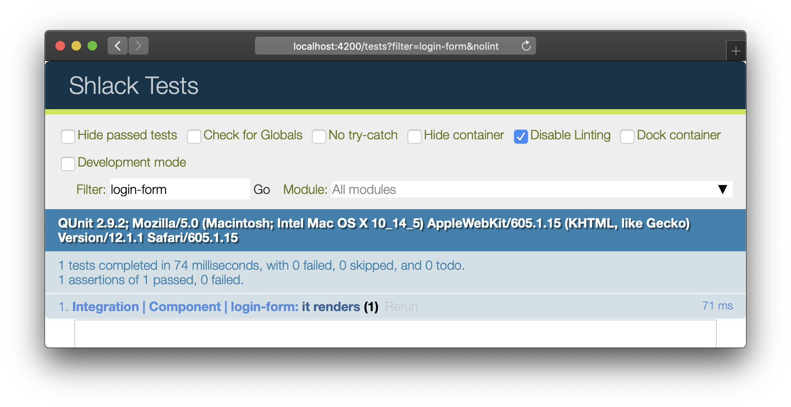
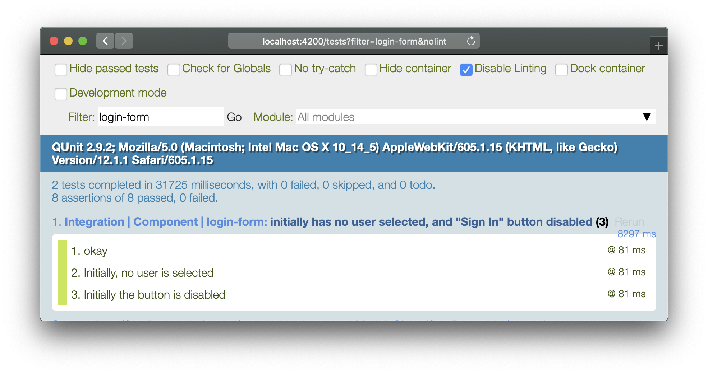
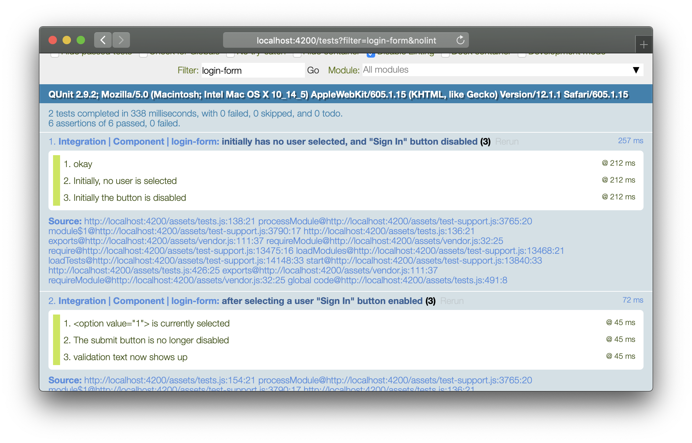

# Integration Tests

As we saw when writing tests for our `{{format-timestamp}}` helper, integration tests in ember involve setting up a scenario with handlebars, rendering it, and then making assertions against the rendered HTML.

Our `<LoginForm />` component has become complicated enough that we should write some meaningful tests for it.

For our learning purposes, we'll just worry about two scenarios

- When the component is initially rendered, no user is selected, and the `input[type="submit"]` is disabled
- Once a user is chosen, the `input[type="submit"]` is enabled, and the `<select>` should have a value of the appropriate user's id

Open up the integration test for `<LoginForm />` - [`tests/integration/components/login-form-test.js`](../tests/integration/components/login-form-test.js). It should look like this

```ts
import { module, test } from 'qunit';
import { setupRenderingTest } from 'ember-qunit';
import { render } from '@ember/test-helpers';
import hbs from 'htmlbars-inline-precompile';

module('Integration | Component | login-form', function(hooks) {
  setupRenderingTest(hooks);

  test('it renders', async function(assert) {
    // Set any properties with this.set('myProperty', 'value');
    // Handle any actions with this.set('myAction', function(val) { ... });

    await render(hbs`<LoginForm />`);

    assert.deepEqual(
      this.element.textContent
        .trim()
        .replace(/\s*\n+\s*/g, '\n')
        .split('\n'),
      ['Login', 'Select a user', 'Testy Testerson', 'Sample McData']
    );
  });
});
```

The `'Integration | Component | login-form'` is the test module name, `'it renders'` is the test name, and `assert.*` are assertions. Think of these as folders, subfolders and files.

```
test module
  test
    assertion
  test
    assertion
  test
    assertion
    assertion
    assertion
```

If you go to http://localhost:4200/tests?filter=login-form&nolint, you can see this information in the test runner UI



Let's change the title of the existing test to something more descriptive

```
'initially has no user selected, and "Sign In" button disabled'
```

We'll need to get ahold of two DOM elements to assert against

1. the "Sign In" button
2. the `<select>`

```js
let button = find('input[type="submit"]');
let select = find('select');
```

If you wanted to add some special autocomplete awesomeness, you could give your editor a clue (via [JSDoc comments](http://usejsdoc.org/tags-type.html)) of the types we expect `find` to return in these cases

```js
let button = /** @type {HTMLInputElement} */ (find('input[type="submit"]'));
let select = /** @type {HTMLSelectElement} */ (find('select'));
```

Now we can write two assertions against these

```js
assert.equal(select.value, '', 'Initially, no user is selected');
assert.equal(button.disabled, true, 'Initially the button is disabled');
```

Go back to http://localhost:4200/tests?filter=login-form&nolint and you should see the nice assertion labels showing up



Create a new test immediately below the first one, and name it something like

```ts
test('after selecting a user "Sign In" button enabled', async function(assert) {
  // ...
});
```

define the test body as follows

```ts
// Render the component
await render(hbs`<LoginForm />`);

// Pluck off the DOM elements we care about
let button = /** @type {HTMLInputElement} */ (find('input[type="submit"]'));
let select = /** @type {HTMLSelectElement} */ (find('select'));

// Select the <option> with value="1"
await fillIn('select', '1');

assert.equal(select.value, '1', '<option value="1"> is currently selected');

assert.equal(button.disabled, false, 'The submit button is no longer disabled');

assert.deepEqual(
  this.element.textContent
    .trim()
    .replace(/\s*\n+\s*/g, '\n')
    .split('\n'),
  [
    'Login',
    'Select a user',
    'Testy Testerson',
    'Sample McData',
    'Logging in with userId 1',
  ],
  'validation text now shows up'
);
```

Going back to http://localhost:4200/tests?filter=login-form&nolint, you should see the new test and all of our nice assertion labels in the test runner UI



Congrats! we've just written a nice component integration test!
