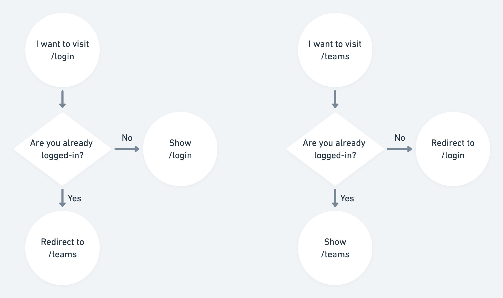

# Guarding Routes

In this exercise, we will be adding redirection in the UI flow based on whether the user is logged in or not.

Specifically, users should be able to access the `login` route only when they are _not logged in_. And similarly, users should be able to access the `teams` route only when they are _logged in_.



So let's get started.

## Enhancing the auth service

First let's enhance the `auth` service, so that we can easily tell if there's a logged in user, and implement a `logout` action. This `auth` service is defined at [`app/services/auth.js`](../app/services/auth.js).

Import the action decorator at the top of the file:

```js
import { action } from '@ember/object';
```

Then add a getter-based property, `isAuthenticated` that will be `true` if the user is logged in and `false` otherwise. Add an action called `logout` that clears the user ID we write to localStorage on login, and sends the user to the `/login` page.

```js
  get isAuthenticated() {
    return !!this.currentUserId;
  }

  @action
  logout() {
    window.localStorage.removeItem(AUTH_KEY);
    this.router.transitionTo('login');
  }
```

Remember the `StubbedAuthService` that we just added? It needs to have the same interface as the real auth service. Let’s add `isAuthenticated` and `logout` to `StubbedAuthService` too:

```js
  get isAuthenticated() {
    return !!this.currentUserId;
  }

  @action
  logout() {
    this.currentUserId = null;
    this.router.transitionTo('login');
  }
```

We also need to import `action` at the top of the file:


```js
import { action } from '@ember/object';
```


## Adding a redirect to the /teams page

In the login route, present at [`app/routes/login.js`](../app/routes/login.js), add a [`beforeModel`](https://api.emberjs.com/ember/3.9/classes/Route/methods/beforeModel?anchor=beforeModel) hook to check whether the user is authenticated, and either redirect the user or not.

In the login route, import the `auth` service, since its not already available(injected).

```js
import { inject as service } from '@ember/service';
import AuthService from 'shlack/services/auth';
```

And, in the same route file(`login` route), inject the imported `auth` service and add the following [`beforeModel`](https://api.emberjs.com/ember/3.9/classes/Route/methods/beforeModel?anchor=beforeModel) hook to handle redirection.

```js
  /**
  * @type {AuthService}
  */
  @service auth;

  async beforeModel(transition) {
    await super.beforeModel(transition);
    if (this.auth.isAuthenticated) {
      this.transitionTo('teams');
    }
  }
```

The jsdoc comment above, for `AuthService`, improves the developer experience when editing the code (that is, `this.auth.*` will have a nice autocomplete).

## Adding a redirect to the /login page

Now let's move on to `teams` route defined at [`app/routes/teams.js`](../app/routes/teams.js).

The `login` route should have a similar [`beforeModel`]((https://api.emberjs.com/ember/3.9/classes/Route/methods/beforeModel?anchor=beforeModel)) hook, but note that the validation logic is flipped in this case. We redirect to the `/login` page only if the user is _logged out_.

In the `teams` route, import the `auth` service, since its not already available(injected).

```js
// app/routes/teams.js
import { inject as service } from '@ember/service';
import AuthService from 'shlack/services/auth';
```

And, in the same route file([`app/routes/teams.js`](../app/routes/teams.js)), inject the imported `auth` service and add the [`beforeModel`](<(https://api.emberjs.com/ember/3.9/classes/Route/methods/beforeModel?anchor=beforeModel)>) hook to check if the user is logged in.

```js

   /**
   * @type {AuthService}
   */
  @service auth;

  async beforeModel(transition) {
    await super.beforeModel(transition);
    if (!this.auth.isAuthenticated) {
      this.transitionTo('login');
    }
  }
```

The jsdoc comment above, for `AuthService`, improves the developer experience when editing the code (that is, `this.auth.*` will have a nice autocomplete).

## Changes in Templates

Now that we have the javascript part of our component in place, let's work on the matching handlebars template.

<!-- What is this inreference to - "for the same"  -->

In `app/templates/components/team-sidebar.hbs`, replace the `LinkTo` component with a plain old HTML `button` element with an onclick handler that will trigger the `logout` action, that you defined in `app/services/auth.js`.

```diff
-    <LinkTo @route='login' {{! destination route }}
-            @tagName="button" {{! use <button> instead of <a> }}
-            class="text-white rounded bg-gray-600 hover:bg-red-700 p-2 team-sidebar__logout-button" {{! HTML classes}}
+    <button {{on "click" this.auth.logout}} class="text-white rounded bg-gray-600 hover:bg-red-700 p-2 team-sidebar__logout-button"
+    >
      Logout
-    </LinkTo>
+    </button>
```

## Adding Tests

Now that we have the implementation in place for our redirect logic, let's add some acceptance tests for the same.

Reasons why acceptance tests are preferred (over unit tests or an integration tests):

1. Rather than just testing individual modules in isolation, we need to test and verify that features (in this case, conditional redirection) work as expected from an end user's perspective, when its part of the entire application.

2. The need to mimic user interactions with the application, and verify things work as expected.

### Test login

In [`tests/acceptance/login-test.js`](../tests/acceptance/login-test.js), import the `StubbedAuthService` service:

```js
import StubbedAuthService from '../test-helpers/auth-service';
```

Then, inject the auth service inside the `beforeEach` hooks for test setup.

```js
hooks.beforeEach(function () {
  this.owner.register('service:auth', StubbedAuthService);
});
```

Modify the test with label, `starting logged out, then logging in` as follows:

```js
test('starting logged out, then logging in', async function (assert) {
  const auth = this.owner.lookup('service:auth');
  auth.currentUserId = null;

  await visit('/login');
  assert.equal(currentURL(), '/login');

  await fillIn('select', '1');
  await click('form input[type="submit"]');

  assert.equal(currentURL(), '/teams');
});
```

Then add a test for the use case when the user is `already logged in`, as follows:

```js
test('already logged in', async function (assert) {
  const auth = this.owner.lookup('service:auth');
  auth.currentUserId = '1';

  await visit('/login');

  assert.equal(currentURL(), '/teams');
});
```

### Test logout

Now let's add acceptance tests to test when users are logged out. The test file is present at [`tests/acceptance/logout-test.js`](../tests/acceptance/logout-test.js).

And as in the previous test, first import the `StubbedAuthService` service:

```js
import StubbedAuthService from '../test-helpers/auth-service';
```

For test with label, 'visiting /teams', remove the definition.
And add a test with label, `visiting /teams while logged in, and then logging out`.

Modify the `beforeEach` in the same way we did for the previous test.

```js
hooks.beforeEach(function () {
  this.owner.register('service:auth', StubbedAuthService);
});
```

Then add the test for accessing `teams` route while being logging in, and then logging out:

```js
test('visiting /teams while logged in, and then logging out', async function (assert) {
  const auth = this.owner.lookup('service:auth');
  auth.currentUserId = '1';

  await visit('/teams'); // Go to a URL

  assert.equal(currentURL(), '/teams'); // Make sure we've arrived
  await click('.team-sidebar__logout-button'); // Click a button

  assert.equal(currentURL(), '/login'); // Make sure we're now at /login
});
```

And finally, let's add a test for the use case `when visiting /teams while logged out`.

```js
test('visiting /teams while logged out', async function (assert) {
  const auth = this.owner.lookup('service:auth');
  auth.currentUserId = null;

  await visit('/teams');

  assert.equal(currentURL(), '/login');
});
```

## Completed File

[view here](https://github.com/mike-north/ember-octane-workshop/commit/f695c3d1720150a066b055b317aaef679f4d4234)
