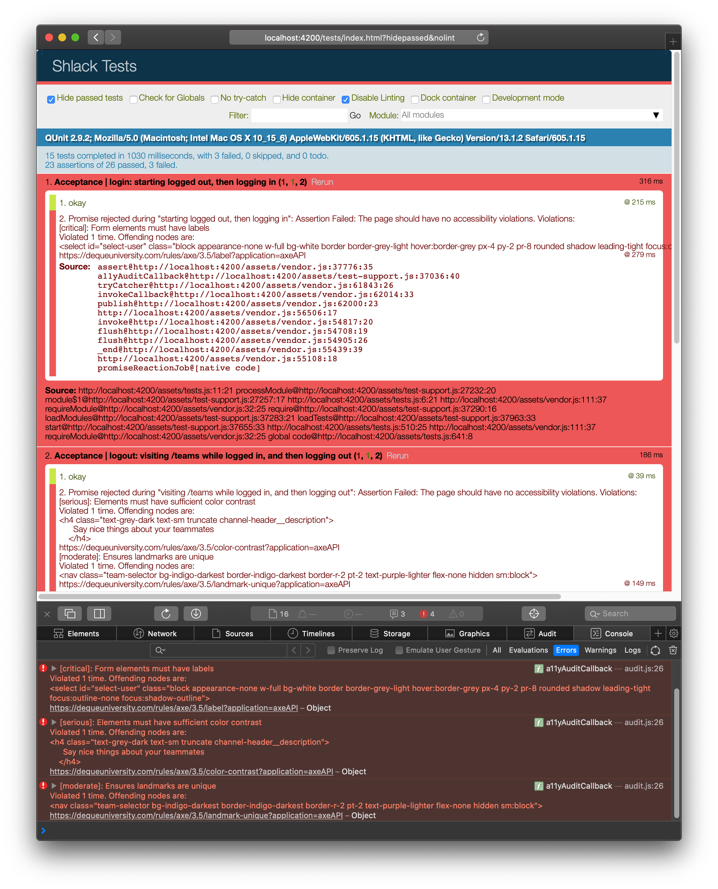

# Accessibility

Accessibility (a11y) refers to design and development standards and best practices that enable users with a wide range of disabilities. These include users with mobility impairments, hearing-related issues, cognitive disabilities, color blindness, low-vision, total blindness, and even aging adults.

While some accessibility issues are the result of poor user experience, others are caused by often-overlooked development best practices and mistakes in markup. The good news is that these types of errors can easily be uncovered with analysis tools, such as the [ember-a11y-testing](https://github.com/ember-a11y/ember-a11y-testing) addon.

The addon works by inspecting the rendered page from within an acceptance test. Accessibility violations cause the test to fail and are output as part of the failure message. For this exercise, we will add a11y checks to our existing acceptance tests and fix all identified accessibility violations.

Let's revisit our acceptance tests under [`tests/acceptance/login-test.js`](../tests/acceptance/login-test.js) and [`tests/acceptance/logout-test.js`](../tests/acceptance/logout-test.js). We'll begin by importing the ember-a11y-testing `a11yAudit` function at the top of each file.

```js
import a11yAudit from 'ember-a11y-testing/test-support/audit';
```

The `a11yAudit` test helper will check the page at the given route, so we need to make sure it's called after we visit a specific URL in our application.

To assess the login page, make the following change to [`tests/acceptance/login-test.js`](../tests/acceptance/login-test.js):
```diff
test('starting logged out, then logging in', async function(assert) {
  const auth = this.owner.lookup('service:auth');
  auth.currentUserId = null;

  await visit('/login');
  assert.equal(currentURL(), '/login');

+ await a11yAudit(); // Verify login page accessibility

  await fillIn('select', '1');

  await click('form input[type="submit"]');

  assert.ok(currentURL().startsWith('/teams'));
});
```

To assess the main application, make the following change to [`tests/acceptance/logout-test.js`](../tests/acceptance/logout-test.js):
```diff
test('visiting /teams while logged in, and then logging out', async function(assert) {
  const auth = this.owner.lookup('service:auth');
  auth.currentUserId = '1';

  await visit('/teams'); // Go to a URL

  assert.ok(currentURL().startsWith('/teams')); // Make sure we've arrived

+ await a11yAudit(); // Verify teams accessibility

  await click('.team-sidebar__logout-button'); // Click a button

  assert.equal(currentURL(), '/login'); // Make sure we've arrived
});
```

Rerun your tests to check for accessibility errors. Use the failure messaging and console output in the developer tools to determine the source of the issues and how to address them.



The first identified issue is that the login user `<select>` element isn't labeled correctly. Form inputs must be properly associated with a `<label>` element so that screen reader users understand the control's purpose.

Make the following change to [`app/templates/components/login-form.hbs`](../app/templates/components/login-form.hbs):
```diff
- <label class="sr-only">Select a user</label>
+ <label class="sr-only" for="select-user">Select a user</label>
  <select
    id="select-user"
    class="block appearance-none w-full bg-white border border-gray-300 hover:border-gray-500 px-4 py-2 pr-8 rounded shadow leading-tight focus:outline-none focus:shadow-outline"
    {{on "change" this.onSelectChanged}}
    >
```

The second issue is that the channel description text has insufficient color contrast in comparison to the white background. As a means of supporting low-vision users, text color requires a minimum threshold, specifically a ratio of 4.5:1, to visually stand out. Inspecting the heading element reveals that color is applied by the `text-gray-700` CSS class. Is there another class available that can be used to improve readability with darker grey text?

Make the following change to [`app/templates/components/channel-header.hbs`](../app/templates/components/channel-header.hbs):
```diff
- <h4 class="text-gray-700 text-sm truncate channel-header__description">
+ <h4 class="text-gray-600 text-sm truncate channel-header__description">
    {{@description}}
  </h4>
```

For an in-depth article about text color contrast, why it's important, and how it gets calculated, see https://css-tricks.com/understanding-web-accessibility-color-contrast-guidelines-and-ratios/.

The final issue is related to landmarks needing to be unique. [Landmarks](https://www.w3.org/TR/wai-aria-practices-1.1/#landmark-roles) are special sections of a page that aid in screen reader navigability, allowing users to quickly jump between various areas of the screen. As it happens, the `<nav>` element is one of these special sections. Our application features two navigational elements, but screen reader users have no means of distinguishing one from the other. The most common way of differentiating recurring landmarks is by [applying unique labeling to each instance](https://www.w3.org/TR/wai-aria-practices-1.1/#naming_with_aria-label) using the `aria-label` attribute.

Make the following change to [`app/templates/components/team-selector.hbs`](../app/templates/components/team-selector.hbs):
```diff
  <!-- Team Selector -->
- <nav class="team-selector bg-blue-900 border-blue-900 border-r-2 pt-2 text-purple-lighter flex-none hidden sm:block">
+ <nav class="team-selector bg-blue-900 border-blue-900 border-r-2 pt-2 text-purple-lighter flex-none hidden sm:block"
+   aria-label="Team">
    <a href="/li" data-team-id="li"
```

And the following change to [`app/templates/components/team-sidebar.hbs`](../app/templates/components/team-sidebar.hbs):
```diff
- <nav class="mb-8 flex-1 team-sidebar__channels-list">
+ <nav class="mb-8 flex-1 team-sidebar__channels-list" aria-label="Channel">
    <div class="px-4 mb-2 text-white flex justify-between items-center">
      <h2 class="opacity-75 text-lg">Channels</h2>
```

All related acceptance tests should now pass, ensuring the application is free of code-related accessibility issues. As a bonus, any new bug that gets inadvertently introduced will be immediately called out and cause our tests to fail, minimizing regressions.

## Completed File
<!-- TODO: not yet existing -->
[view here](#)
