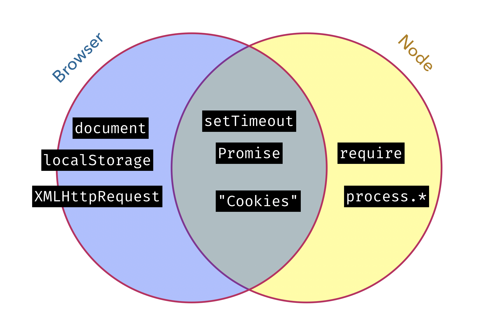

# Server Rendering with Fastboot

Ember's server rendering technology is called "Fastboot". Effectively, it's a small distributed system with one Node process that receives requests, and N workers, each of which maintains a "warm" ember app, ready to emit HTML for a given URL.

The idea is that you should _not_ be writing two apps (despite needing to run on two different environments). In order to do this, you'll need to stick to the _overlap_ of browser and Node.js APIs.



First, let's install fastboot to enable server-rendering

```
ember install ember-cli-fastboot
```

Open your [`config/environment.js`](../config/environment.js), and add a `fastboot` object as a top-level property of the `ENV` property you'll find there.

```diff
+    fastboot: {
+      hostWhitelist: [/localhost/],
+    },
     APP: {
```

We'll have to refactor our `auth` service so that it doesn't use any browser-specific APIs.

To do this we can install `ember-cookies`, a unified abstraction that can provide us with a way of dealing with cookies both in node and in a browser environment

```
ember install ember-cookies
```

Now let's stop and restart ember-cli -- we should see that the app is now being served with fastboot.

Next, we'll have to make some adjustments to the auth service. Begin by importing the cookie service

```js
import CookiesService from 'ember-cookies/services/cookies';
```

and inject the `cookies` service onto the `auth` service

```ts
 /**
  * @type {CookiesService}
  */
 @service cookies;
```

Update the `loginWithUserId` function so it writes to a cookie instead of `localStorage`

```diff
   async loginWithUserId(userId) {
-    window.localStorage.setItem(AUTH_KEY, userId);
+    this.cookies.write(AUTH_KEY, userId);
     this.router.transitionTo('teams');
   }
```

Update the `currentUserId` getter so it reads from a cookie

```diff
   get currentUserId() {
-    return window.localStorage.getItem(AUTH_KEY);
+    return this.cookies.read(AUTH_KEY);
   }
```

and update `logout so it clears the value from the cookie instead of`localStorage`

```diff
   logout() {
-    window.localStorage.removeItem(AUTH_KEY);
+    this.cookies.write(AUTH_KEY, null);
     this.router.transitionTo('login');
   }
 }
```
