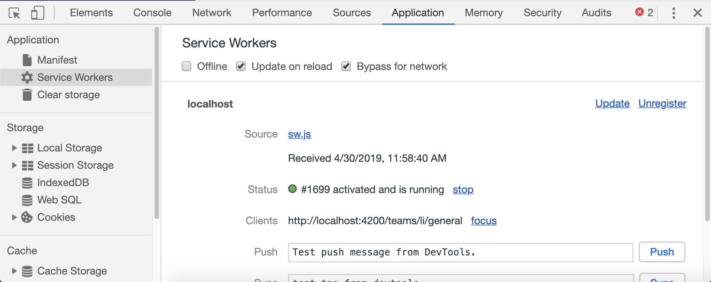

# Progressive Web App

PWA technologies allow us to push web apps even closer to a native-like experience. The most powerful (and challenging to implement) part
of this group of APIs is a _Service Worker_

Service workers are a topic in and of themselves, and if you want to learn more about them

- see my PWA course
- kyle simpson has a workshop too (https://frontendmasters.com/workshops/service-worker-pwa/)

Thankfully, Ember's opinionated ecosystem allows us to share a common package for this

```sh
ember install \
  ember-service-worker \ # core addon
  ember-service-worker-asset-cache \ # caching static assets
  ember-service-worker-cache-fallback \ # fallback cache for API calls
  ember-service-worker-index # special handling of index.html
```

There's _almost_ no configuration required. The one thing we have to do is inform the fallback cache of the URLs we want it to "save" data for as they pass through. This way if we lose connectivity, we'll fall back to the cached payloads.

Open [`ember-cli-build.js`](../ember-cli-build.js) and make this change.

```diff
   let app = new EmberApp(defaults, {
+    'esw-cache-fallback': {
+      patterns: ['/api/(.+)']
+    }
   });
```

Now if you go to the service worker section of your devtools, you should see something like this.



<hr>
<p>
  <blockquote>
    <h3>
      💡 Mike's Tip: Service Worker Devtools
    </h3>
    <a href="https://github.com/mike-north">
      
    </a>
    <p>
      When developing an app that uses a Service Worker, remember to consider your developer tools, or you may be in for a frustrating experience. 
      <p><b>You'll nearly always want "Update on reload" checked, so that a new worker is installed on each refresh.</b> Leaving this un-checked will interfere with your browser picking up on changes as you save files. </p>
    </p>
  </blockquote>
</p>
<hr>

Now, to test out our ability to go offline,

- Uncheck all boxes
- Reload
- Check the "offline" box

The app will load! You can even turn off your wifi and the app will still work!

Note that as soon as you try to see anything you haven't previously seen (i.e., a channel you haven't clicked on), you'll get an error. You're caching API payloads _as they fly by_. Deliberately caching particular URLs is a very easy change to make, but beyond the scope of this course.
